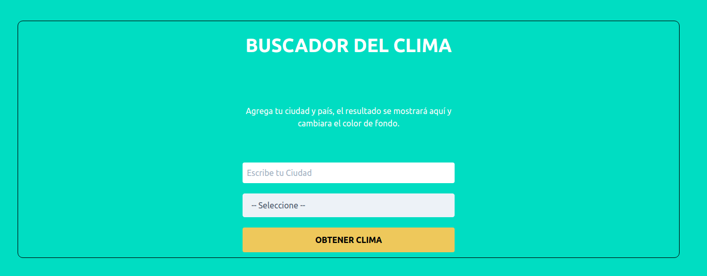

# Weather App

### App to search for weather data

## Area

- [x] Frontend
- [ ] Backend.
aaa
## Deploy

- [x] Local.
- [ ] Heroku.
- [ ] AWS.
- [x] Netlify: https://climaapp-fetchapi-js.netlify.app/
- [x] None.

## Table of Contents

- [Instalation](#installation)
- [Documentation](#documentation)
- [Images](#images)
- [Technologies](#technologies)

## Instalation:

- Clone the repository or download
- Open whith editor
- Open Terminal

## Images:

## Technologies:

- HTML
- CSS
- Javascript

## Project management software

- [ ] Trello:
- [ ] Jira:
- [x] None

## Agile methodology

- [ ] Scrum
- [ ] Kanban
- [x] Not applied

## CI/CD

- [ ] Applied
- [x] Not applied

## AWS(services)

- [ ] Applied
- [x] Not applied

## Docker

- [ ] Apllied
- [x] Not applied
